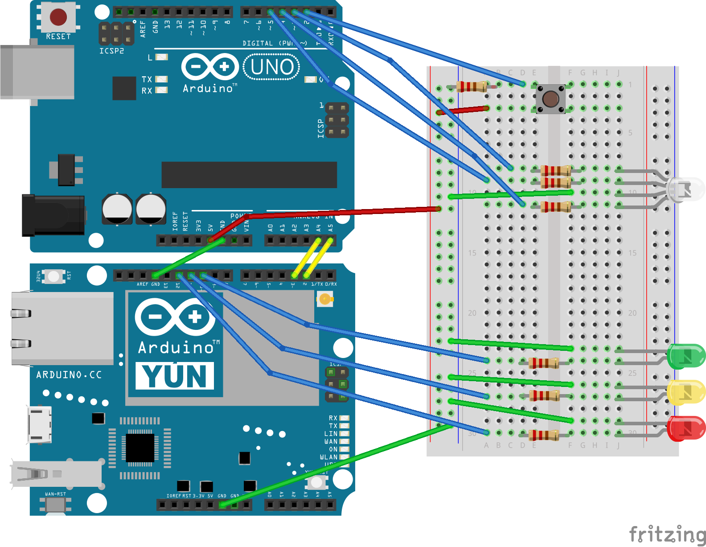

# Overview
A IoT biometrics reading device, which utilizes the Amazon AWS IoT service to communicate with a python-based desktop client.

The core concept is a IoT biometrics reader, which utilizes a Arduino UNO R3 with a e-Health sensor shield and Pulsioximeter sensor. It connects to an Arduino Yún which transmits the collected data to the AWS IoT platform. Furthermore a python based client, independent from the Arduino, provides access to the uploaded data and enables data upload requests. Conceptually a healthcare providerwould be able to remotely monitor patient biometrics, by being able to request/analyse biometric data in tandem with direct patient e-communication. This would reduce the amount of time spent both by patients and healthcare providers in both initial diagnosing and extended non-intensive patient monitoring.
#Device Functions
* Red LED turns on when a connection is successfully established to the AWS IoT service.
* Yellow LED turns on when there's a pending reading request from the python client.
* Green LED turns on when data is being transmitted to the device shadow.
* RGB LED turns blue when device is in Sleep Mode.
* RGB LED turns green when the switchbutton is pressed, indicating that device is active.
* RGB LED turns cyan when the pulsioximeter is transmitting data. 
* 
#Client Functions
The client has the following options:
* Request biometric reading.
* Cancel biometric reading requests.
* View latest biometric reading.

# Setup
1. Download and install 2 versions of the Arduino IDE, 1.6.0+ for the Arduino Yún and 1.0.1+ for the Arduino Uno R3. https://www.arduino.cc/en/Main/Software>.
2. Download and install the [AWS-IoT-Arduino-Yún-SDK](https://github.com/aws/aws-iot-device-sdk-arduino-yun) for the 1.6.0+ IDE.
3. Download and install the [e-Health Library for Arduino](https://www.cooking-hacks.com/documentation/tutorials/ehealth-biometric-sensor-platform-arduino-raspberry-pi-medical#step3_1) for the 1.0.1+ IDE.
4. Load the "Arduino-Yun-Sketch" onto the Arduino Yún.
5. Load the "Arduino-Uno-Sketch" onto the Arduino Uno R3.
(6). Make sure the Arduino Yun is properly [set-up and configured to a wifi network](https://www.arduino.cc/en/Guide/ArduinoYun).

# Components
* Arduino Uno R3
* Arduino Yún
* [e-Health Sensor Shield V2.0](<https://www.cooking-hacks.com/documentation/tutorials/ehealth-biometric-sensor-platform-arduino-raspberry-pi-medical>)
* RGB LED
* Switch Button
* 7 x 220 Ohm Resistors

# Circuit
e-Health Sensor Shield not pictured but goes on top of the Arduino Uno R3.

